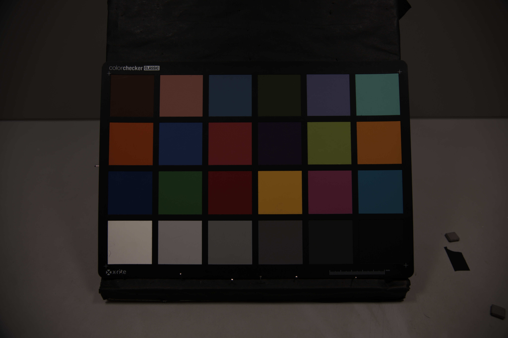
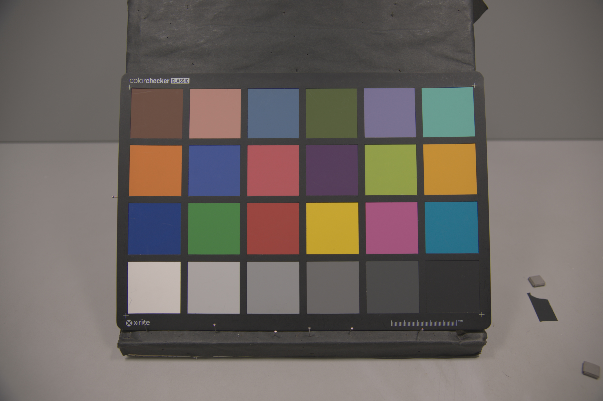
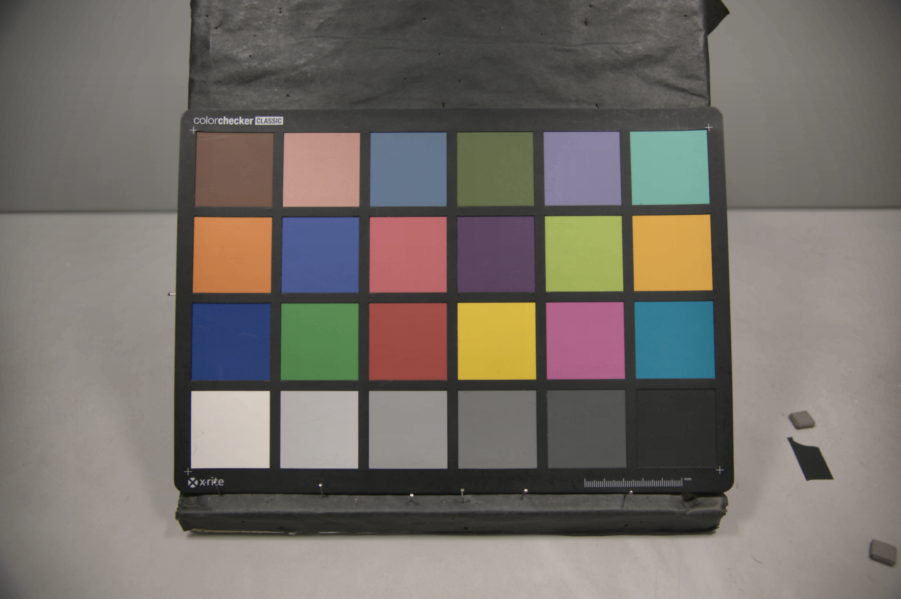
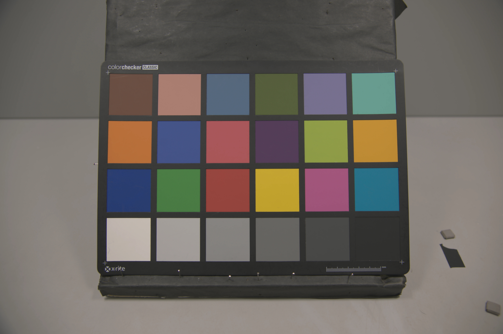

# Fast Open Image Signal Processor (fast-openISP)

As told by its name, fast-openISP is a **faster** (and bugs-fixed) re-implementation of
the [openISP](https://github.com/cruxopen/openISP) project.

Compared to C-style code in the official openISP repo, fast-openISP uses pure matrix implementations based on Numpy, and
increases processing speed **over 300 times**.

Here is the running time in my Ryzen 7 1700 8-core 3.00GHz machine with the 1920x1080 input Bayer array:

|Module             |openISP |fast-openISP|
|:-----------------:|:------:|:----------:|
|DPC                |20.57s  |0.29s       |
|BLC                |11.75s  |0.02s       |
|AAF                |16.87s  |0.08s       |
|AWB                |7.54s   |0.02s       |
|CNF                |73.99s  |0.25s       |
|CFA                |40.71s  |0.20s       |
|CCM                |56.85s  |0.06s       |
|GAC                |25.71s  |0.07s       |
|CSC                |60.32s  |0.06s       |
|NLM                |1600.95s|5.37s       |
|BNF                |801.24s |0.75s       |
|CEH<sup>*</sup>    |-       |0.14s       |
|EEH                |68.60s  |0.24s       |
|FCS                |25.07s  |0.08s       |
|HSC                |56.34s  |0.07s       |
|BBC                |27.92s  |0.03s       |
|End-to-end pipeline|2894.41s|7.82s       |

> <sup>*</sup> CEH module is not included in the official openISP pipeline.


# Usage

Clone this repo and run

```
python demo.py
```

The ISP outputs will be saved to `./output` directory.

The only required package for pipeline execution is `numpy`. `opencv-python` and `scikit-image` are required only for 
data IO.

# Algorithms

All modules in fast-openISP
reproduce [processing algorithms](https://github.com/cruxopen/openISP/blob/master/docs/Image%20Signal%20Processor.pdf)
in openISP, except for EEH and BCC modules. In addition, a CEH (contrast enhancement) module with [CLAHE](https://en.wikipedia.org/wiki/Adaptive_histogram_equalization#Contrast_Limited_AHE) is 
added into the fast-openISP pipeline.

### EEH (edge enhancement)

The official openISP uses
an [asymmetric kernel](https://github.com/cruxopen/openISP/blob/49de48282e66bdb283779394a23c9c0d6ba238ff/isp_pipeline.py#L150-L164)
to extract edge map. In fast-openISP, however, we use the subtraction between the original and the gaussian filtered
Y-channel as the edge estimation, which reduces the artifact when the enhancement gain is large.

### BCC (brightness & contrast control)

The official openISP enhances the image contrast by pixel-wise enlarging the difference between pixel values and a
constant integer (128). In fast-openISP, we use the median value of the whole frame instead of a constant.


# Parameters

Tunable parameters in fast-openISP are differently named from those in openISP, but they are all self-explained,
and no doubt you can easily tell the counterparts in two repos. All parameters are managed in a yaml 
in [`./configs`](./configs), one file per camera.

# Demo

|Bayer Input|
|:-------------------------:|
|| 


|CFA Interpolation|
|:-------------------------:|
|| 


|Color Correction|
|:-------------------------:|
|| 


|Gamma Correction|
|:-------------------------:|
|| 


|Non-local Means & Bilateral Filter|
|:-------------------------:|
|| 


|Contrast Enhancement|
|:-------------------------:|
|| 


|Edge Enhancement|
|:-------------------------:|
|| 


|Hue & Saturation Control|
|:-------------------------:|
|| 


|Brightness & Contrast Control|
|:-------------------------:|
|| 


# License

Copyright 2021 Qiu Jueqin.

Licensed under [MIT](http://opensource.org/licenses/MIT).
